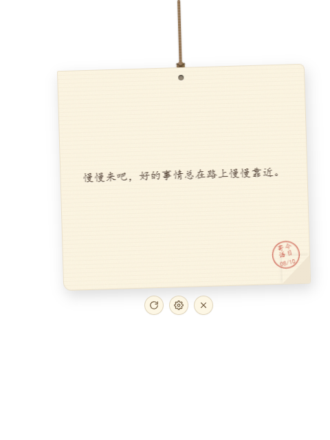
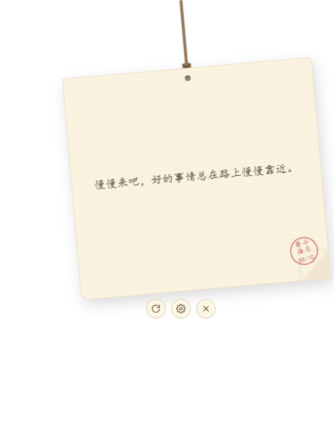

# WindChimeNote · 风铃便签


> A hand-drawn style desktop sticky-note widget that hangs from the top of your Windows desktop. A rope suspends a cream paper card that sways in the wind, delivering a short motivational quote every day.
>
> 一枚从 Windows 桌面顶部垂下的手绘风便签小组件。绳子牵着一张米白纸卡随风轻摆，每天送你一句二十字励志短句。




## ✨ Features

- **Swing physics** — a damped spring pendulum (click / drag / hover / breeze), or a classic keyframe mode. Feel is tunable via `SWING_PARAMS` in `usePhysicsSwing.ts`.
- **Daily quotes** — 100 built-in short quotes (18–22 chars, 5 categories), plus your own custom quotes.
- **AI generation (optional)** — fill in any OpenAI-compatible endpoint to let AI write a fresh quote on demand. Fully offline when left blank.
- **Pin to desktop** — sticker mode: the whole window becomes click-through until unlocked from the tray.
- **Collapse animation** — rolls up into a small dot at the top edge; click to expand with a bounce.
- **4 themes** — warm / pink / green / kraft paper. Window opacity 30–100%, scale 0.6×–1.2×.
- **Font size & line clamp** — 12–28px font, 1–3 display lines.
- **Right-click menu**, **system tray** (show / hide / quit), **global shortcut** `Ctrl+Shift+Q`, **auto-start**.
- **Mouse passthrough** — clicks outside the card fall through to the desktop.

## 🧱 Tech Stack

| Layer | Choice |
|---|---|
| Desktop framework | Tauri v2 (Rust) |
| Frontend | React 18 + TypeScript 5 (strict) + Vite 5 |
| Styling | Tailwind CSS 3 + custom CSS |
| State | Zustand 5 |
| Animation | Framer Motion 11 |
| Persistence | Tauri Store Plugin (localStorage fallback in browser) |

## 🚀 Getting Started

```bash
npm install

# Frontend-only preview in browser (Tauri APIs degrade to no-ops)
npm run dev

# Desktop dev mode (Vite + cargo run)
npm run tauri:dev

# Build installers (.msi + .exe)
npm run tauri:build
```

Artifacts are written to `src-tauri/target/release/bundle/` (`msi/` and `nsis/`).

### Requirements

- Node.js ≥ 18
- Rust stable (`rustup`)
- Visual Studio Build Tools — "Desktop development with C++" workload (MSVC v143 + Windows SDK)
- WebView2 Runtime (built into Windows 11; installer bootsstraps it if missing)

## 🖱️ Interactions

| Action | Effect |
|---|---|
| Hover the card | Wider sway, control buttons fade in |
| Drag the card | Moves window horizontally; springs back on release; position persisted |
| Refresh button | Card flips on Y axis, quote changes at midpoint |
| Gear button | Slides out the settings drawer |
| Close button | Hides to system tray |
| `Ctrl + Shift + Q` | Global show / hide |
| Tray left-click | Toggle visibility |
| Tray right-click | Show / hide / quit |

Clicks outside the card pass through to the desktop — it never blocks desktop icons.

## ⚙️ Settings

- **Opacity** 30–100% (Windows layered window, true whole-window alpha)
- **Size** 0.6× / 0.8× / 1.0× / 1.2× (CSS scale synced with window size)
- **Theme** warm / pink / green / kraft
- **Daily update** new quote every 00:00; disable for manual-only switching
- **Auto-start** managed by Tauri Autostart plugin
- **Custom quotes** appended to a separate pool, coexist with the 100 built-in ones
- **Online generation (optional)** OpenAI-compatible endpoint for AI-written quotes; empty = fully offline

## 📁 Project Structure

```
src/
├── components/       # Rope / NoteCard / QuoteText / DailyStamp / ControlButtons
│   └── settings/     # atomic controls & sections for the settings drawer
├── hooks/            # swing physics / drag / quote management / daily update / mouse passthrough
├── stores/           # Zustand + persistence
├── services/         # quote selection & optional AI calls
├── lib/              # Tauri adapter (browser fallback), store I/O
├── data/quotes.json  # 100 quotes, 18–22 chars each
└── styles/           # paper texture, keyframe animations
src-tauri/
├── src/lib.rs        # window build / plugin registration / global shortcut
├── src/tray.rs       # system tray
├── src/passthrough.rs# mouse passthrough polling
├── src/platform.rs   # cursor position
└── src/commands.rs   # commands exposed to the frontend
```

## 🧠 Design Notes

**Mouse passthrough** — Tauri only toggles mouse events for the whole window. The frontend periodically reports the bounding box of interactive elements; a background thread polls the global cursor position (40ms) and only calls `set_ignore_cursor_events` when crossing the boundary, avoiding high-frequency system calls. While dragging, the whole window stays interactive so the mouse can't slip off the card.

**Window opacity** — Tauri v2 has no cross-platform `setOpacity`; on Windows this uses `WS_EX_LAYERED` + `SetLayeredWindowAttributes` for whole-window alpha.

**Environment adapter** — all system calls are gathered in `src/lib/tauri.ts`, returning safe defaults outside Tauri, so `npm run dev` works in a plain browser for visual/interaction debugging.

## 🧹 Uninstall

The NSIS installer ships a `POSTUNINSTALL` hook that clears config & WebView cache under `%APPDATA%` / `%LOCALAPPDATA%` and removes the auto-start registry entry.

## 📜 License

[MIT](LICENSE)
